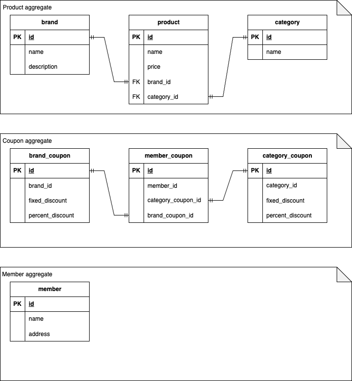

# 무신사 상품 조회 클론 프로젝트
무신사에서는 수많은 상품과 쿠폰을 관리 중인데도 불구하고, 매우 빠른 속도를 보장하고 있습니다. 이에 상품, 브랜드, 카테고리, 쿠폰 데이터를 모델링하여 기능을 구현하고, 성능 테스트를 진행합니다.

# Feature
1. **사용자는 특정 카테고리의 상품을 할인된 가격 기준으로 높은 가격 순으로 정렬하여 볼 수 있다.**
   - 이때 가격이 같다면 상품 등록 수정 일시가 빠른 순으로 정렬한다.
2. **사용자는 특정 카테고리의 상품을 할인된 가격 기준으로 낮은 가격 순으로 정렬하여 볼 수 있다.**
   - 이때 가격이 같다면 상품 등록 수정 일시가 빠른 순으로 정렬한다.
3. **사용자는 브랜드 할인 쿠폰과 카테고리 할인 쿠폰을 여러 개 가질 수 있다.**
4. **쿠폰은 정액 할인이거나 정률 할인이어야 한다.**

# table

# load test scenario
1. 프로젝트를 도커라이징하여 이미지를 만든다.
2. docker-desktop 환경에서 1 core 2gb memory로 해당 이미지로 실행한다.
3. locust를 사용하여 tps, rps를 얼마나 버틸 수 있는지 확인한다.
