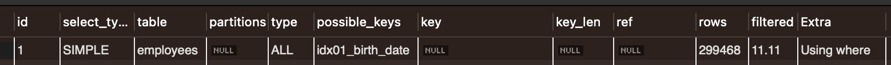
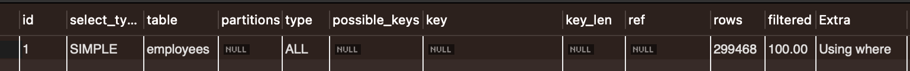
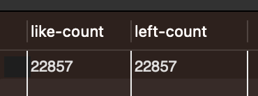

# left, like 명령어 인덱스 분석

like 명령어는 % 문자의 위치에 따라 인덱스를 사용할 수도 있고, 사용하지 못할 수도 있습니다.
대표적으로 % 문자를 뒤에 붙이면 인덱스를 사용할 수 있는데 간단한 예시를 들면 아래와 같습니다.

1. 국어
2. 수학 1
3. 수학 2
4. 수학의 정석
5. 영어

와 같은 정보가 저장되어 있다고 가정할 때 수학으로 시작하는 과목을 선택하려고 했을 때 2,3,4가 한번에 찾아지는 원리와 같습니다.

like가 인덱스를 사용하는 것을 인지하고 있는 상황에서 비슷한 연산을 할 수 있는 left 명령어가 인덱스를 사용할 수 있는지 궁금하여 실험 해봤습니다.

## like 명령어를 사용하여 startsWith 구현
> birth_date를 사용한 인덱스가 생성되어 있다고 가정한다.

```
select * from employees where birth_date like "1953%";

-> Filter: (employees.birth_date like '1953%')  (cost=30179 rows=33271) (actual time=0.139..133 rows=22857 loops=1)
    -> Table scan on employees  (cost=30179 rows=299468) (actual time=0.132..93.1 rows=300024 loops=1)
```

실행 계획을 확인해보면 33,271 row 정보를 스캔하는 것을 알 수 있습니다. 전체 row 수가 30만 건인 것을 생각하면 약 11%의 정보만 확인했습니다.



위 이미지를 통해 like 명령어 수행시 idx01_birth_date 인덱스를 사용하고 11.11%의 정보만을 스캔했다는 것을 알 수 있습니다.


## Left 명령어를 사용하여 startsWith 구현

```
select * from employees where left(birth_date, 4) = "1953";

-> Filter: (left(employees.birth_date,4) = '1953')  (cost=30179 rows=299468) (actual time=0.084..120 rows=22857 loops=1)
    -> Table scan on employees  (cost=30179 rows=299468) (actual time=0.0778..93.6 rows=300024 loops=1)
```

like 명령어와 다르게 299,468건의 정보를 스캔하는 것을 알 수 있습니다. 거의 모든 행에 대한 정보를 확인했습니다.



위 이미지에서도 알 수 있듯 filter 값이 100%이고, 사용 가능한 인덱스가 없는 것으로 나와 테이블 full 스캔을 한 것을 알 수 있습니다.

## 마무리
같은 기능을 하지만 하나는 인덱스를 사용할 수 있고, 하나는 인덱스를 사용할 수 없는 것을 확인했습니다.

left 연산의 경우 모든 행에 대해 먼저 입력된 파라미터(문자열 수)에 맞게 처리를 한 후에 검색을 진행하기 때문으로 추정됩니다.

like, left의 결과가 다를 수 있기 때문에 검색된 row 수를 비교해봤습니다.


