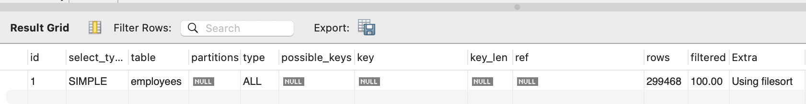
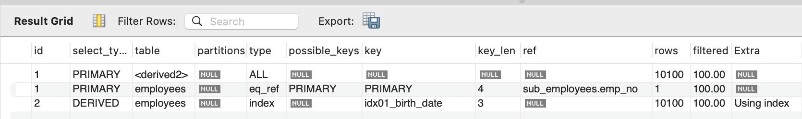
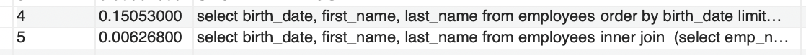

# offset 최적화

많은 양의 데이터가 저장되어 있는 경우(ex. 상품 정보, 예약 정보 등) 페이징 처리를 하게 되는데요. 이때 테이블의 row 수가 많아지면 많아질 수록 성능에 영향을 미칠 수 있습니다.

많아질 수록 성능에 영향을 주지만 일반적으로 offset은 인덱스를 사용하지 못합니다.
이는 offset 이후 정보를 채택하기 때문인데요. 예를 들어 offset: 10000, limit: 100인 경우 10000개의 데이터를 조회한 후에 그 다음에 오는 100개의 데이터를 채택하려고 하기 때문이빈다.

이럴 때 사용할 수 있는 방법은 `inner join`을 사용하는 것입니다.

## 예시 #1 - 일반적인 페이징 처리
```
select birth_date, first_name, last_name from employees
	order by birth_date limit 10000, 100;

-> Limit/Offset: 100/10000 row(s)  (cost=30179 rows=100) (actual time=148..148 rows=100 loops=1)
    -> Sort: employees.birth_date, limit input to 10100 row(s) per chunk  (cost=30179 rows=299468) (actual time=147..147 rows=10100 loops=1)
        -> Table scan on employees  (cost=30179 rows=299468) (actual time=0.059..76.8 rows=300024 loops=1)
```

## 실행 계획 이미지


위 쿼리는 0.15ms가 소요되는 퀴리입니다.
실행 계획을 보면 정렬을 사용하여 페이징을 처리하기 때문에 모든 데이터를 조회한 후에 birth_date를 기준으로 정렬하고, 앞에 10000개의 데이터를 버리는 것을 알 수 있습니다.

## 예시 #2 - inner join을 사용한 페이징 처리

단순 페이징에서 시간을 소용하는 부분을 `inner join`으로 변경했습니다.

```
select birth_date, first_name, last_name from employees
	inner join  (select emp_no from employees order by birth_date limit 10000, 100) as sub_employees on sub_employees.emp_no = employees.emp_no;

-> Nested loop inner join  (cost=2591 rows=100) (actual time=6.59..7.16 rows=100 loops=1)
    -> Table scan on sub_employees  (cost=51.9..55.6 rows=100) (actual time=6.56..6.59 rows=100 loops=1)
        -> Materialize  (cost=51.9..51.9 rows=100) (actual time=6.56..6.56 rows=100 loops=1)
            -> Limit/Offset: 100/10000 row(s)  (cost=41.9 rows=100) (actual time=6.45..6.5 rows=100 loops=1)
                -> Covering index scan on employees using idx01_birth_date  (cost=41.9 rows=10100) (actual time=0.0943..5.77 rows=10100 loops=1)
    -> Single-row index lookup on employees using PRIMARY (emp_no=sub_employees.emp_no)  (cost=0.25 rows=1) (actual time=0.00523..0.00531 rows=1 loops=100)
```

## 실행 계획 이미지


위 쿼리는 0.006ms가 소요되는 쿼리입니다. 일반 페이징에 비해 2500%의 성능 향상이 이뤄졌는데요. 실행 계획에서 볼 수 있듯이 페이징 쿼리임에도 인덱스를 사용하는 것을 알 수 있습니다.

`sub_employees`에서 birth_date로 정렬된 10000~10100까지의 데이터를 조회한 후에 이를 원본 `employees`와 조인하는 것을 알 수 있습니다.
- 조건에 해당하는 데이터를 임시 데이터 `sub_employees`로 뽑아 inner join한다.
- 임시 데이터에 이미 페이징 처리된 정보가 있으므로 join을 하여 정보만 보여주면 된다.

## 쿼리 실행 시간(위: 일반 페이징, 아래: inner join 페이징)

