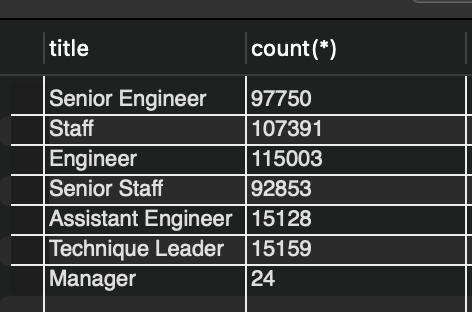
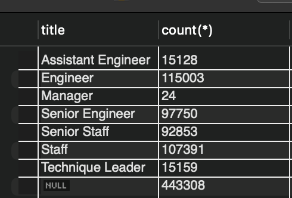
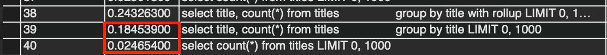

# with rollup을 사용하여 count 최적화
저장된 데이터를 group by를 사용하여 개수를 세는 경우 group by로 그룹핑된 값의 총합을 얻고 싶은 경우가 있습니다.

보통 조회한 결과로 application 레벨에서 총합을 개산하거나 전체 개수를 조회하는 쿼리를 한번 더 실행시키는 것을 고려해볼 수 있습니다.

이때, roll up을 사용하면 한번의 쿼리로 총합의 개수까지 가져올 수 있습니다.

## 예시 #1 - 쿼리 2번을 실행시켜 총합을 가져오는 경우

> 요구사항: titles에는 모든 직원의 직군이 저장되어 있다. 각 직권의 직원 수와 그 합을 알고 싶다.

아래 쿼리는 각 직군 별로 직원 수를 계산하는 쿼리이다.
```
select title, count(*) from titles 
	group by title;

-> Table scan on <temporary>  (actual time=196..196 rows=7 loops=1)
    -> Aggregate using temporary table  (actual time=196..196 rows=7 loops=1)
        -> Covering index scan on titles using PRIMARY  (cost=44579 rows=442664) (actual time=0.112..83.5 rows=443308 loops=1)
```

## 결과 이미지


아래 쿼리는 모든 직군의 총합을 계산하는 쿼리이다.
```
select count(*) from titles;
-> Count rows in titles  (actual time=28.3..28.3 rows=1 loops=1)
```

## 결과 이미지


총 2번의 쿼리를 실행하여 요구사항을 충족했습니다.
1. 각 직군별로 직원 수를 구한다.
2. 전체 직원 수를 구한다.

### 예시 #2 - with rollup을 사용하여 한번에 총합을 가져오는 경우

group by 뒤에 `with rollup`만 추가했습니다.

```
select title, count(*) from titles
		group by title with rollup;

-> Group aggregate with rollup: count(0)  (cost=88846 rows=666) (actual time=213..259 rows=8 loops=1)
    -> Sort: titles.title  (cost=44579 rows=442664) (actual time=211..225 rows=443308 loops=1)
        -> Index scan on titles using PRIMARY  (cost=44579 rows=442664) (actual time=0.0721..88.3 rows=443308 loops=1)
```

## 결과 이미지


이미지를 통해 확인할 수 있듯이 마지막 row에 집계를 총합한 값이 생성된 것을 알 수 있습니다.

## 쿼리 실행 시간 (위: with rollup, 아래 2개: 일반 그룹핑)


with rollup을 사용한 쿼리의 경우 0.24 ms가 걸렸고, 2개의 쿼리로 계산한 결과는 0.2 ms의 시간이 걸렸습니다.
알반적으로 쿼리를 실행하기 위해서는 db connection을 얻어야하기 때문에 with rollup이 조금 더 실행 시간이 걸리지만 connection을 한번만 얻어도 되어 이점이 있을 것 같습니다.
